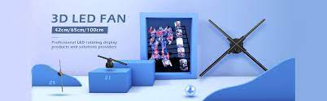
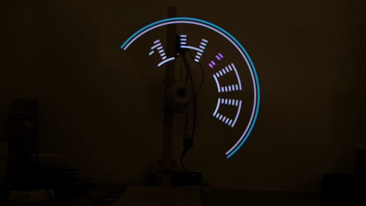
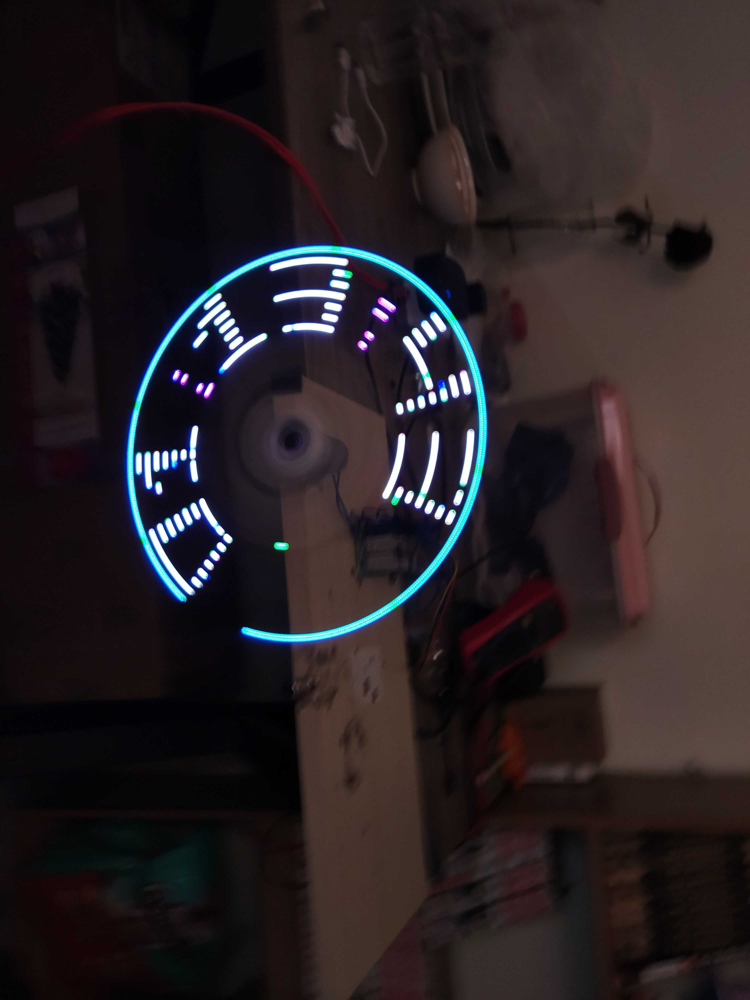

  

    
    
    
    
    

Introducing the LED Fan a next-gen product merging smart time management with entertainment services. Embrace the future of convenience and enjoyment with the LED FAN.

## Learn More about LED FAN CLOCK
 

  

# Table of Contents
1. [Technologies](#1-technologies)
2. [Features](#2-features)
3. [Usage](#3-usage)
4. [Protocols](#4-protocols)
5. [Contributing](#5-contributing)
6. [License](#6-license)
7. [Demo LED FAN CLOCK](#7-demo-led-fan-clock). 

## 1. Technologies
 

  

* **STM32 Microcontroller**: The project is based on the STM32 micro-controller platform, which offers a wide range of micro-controllers with different performance levels and features.
*  **STM32CubeIDE**: The project was developed using popular IDEs which is STM32CubeIDE, provide tools for code development, debugging, and firmware deployment.
*  **Communication Protocols**: The project includes the implementation of communication protocols such as UART, I2C, SPI, and wireless protocols like BLE .
*  **Peripheral Libraries**: The project utilizes peripheral libraries provided by the micro-controller manufacturer or third-party libraries to simplify the integration and configuration of peripherals.
*  **Other Device**: We integrated a lot of device to increase experiment of customer and performance of device .
*  See our [document](./feature_of_project.md), [system architecture](./assets/others/led_fan_architecture.drawio.svg) and [system design](./assets/pictures/device_diagram.jpg) for more details .

## 2. Features
 

  

The LED CLOCK includes new capabilities such as:

1. **Time and Temperature Display**: The LED FAN can display time (hours, minutes, seconds), dates along with ambient temperature.

2. **Reminders and Notifications**: The user can set alarm, countdowns, along with adjustable audio and RGB LED notifications when the specified time is reached.

3. **Computer Interaction Capability**: The time display on the fan is adjustable through universal asynchronous receiver / transmitter (UART). Users can also update the firmware through a computer.
4. Read our [release note](./RELEASE_NOTE.md) for more details and Look forward to other exciting features in the future . 

## 3. Usage
1. Clone the project repository from [GitHub ↗](https://github.com/NhatKha17/led_fan_pov.git).
2. Set up your development environment with the required IDE (STM32CubeIDE) and toolchain and open the project in the chosen IDE.
3. Read our [diagram](./assets/pictures/device_diagram2.png) to connect the necessary peripherals or sensors to the STM32 micro-controller.
4. Deploy the firmware to the STM32 micro-controller using the appropriate flashing method (e.g., ST-Link, DFU, or BootLoader).

## 4. Protocols
Check out the protocol documentation [here](./protocol.md).

## 5. Contributing
We welcome contributions to this project! To ensure a smooth contribution process, please follow the guidelines below:

1. Make sure you have read and understood the Contribution Guide before getting started.
2. Check the Issues to see if there are any existing issues or requested features.
3. Create a new branch from main to work on your new feature: git checkout -b new-feature.
4. Make the necessary changes, additions, or bug fixes in the source code.
5. Double-check the code to ensure there are no errors and that it follows the coding guidelines.
6. Create a Pull Request with a detailed description of the changes you have made.
7. Wait for feedback and make any requested changes from the code reviewer.
8. Once your Pull Request is approved, thank you for your contribution and support!

## 6. Demo LED FAN CLOCK
Below are a few typical features of LED FAN CLOCK

[Link Demo](https://www.youtube.com/watch?v=LPGiybGQYJo&t=4s)

[UART connectivity Demo](https://www.youtube.com/watch?v=dK3ozDyzcKM&t=5s)