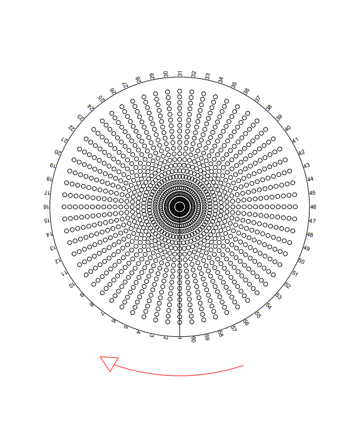
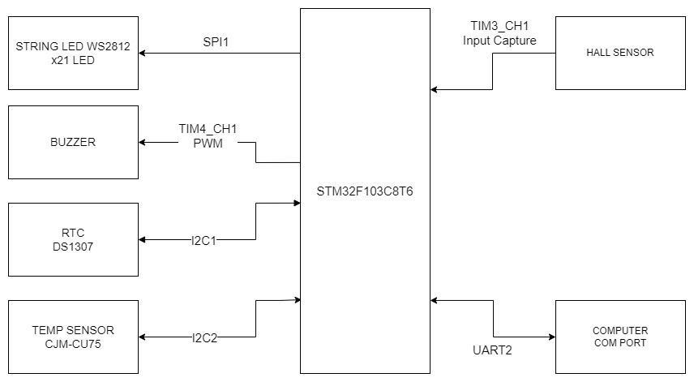
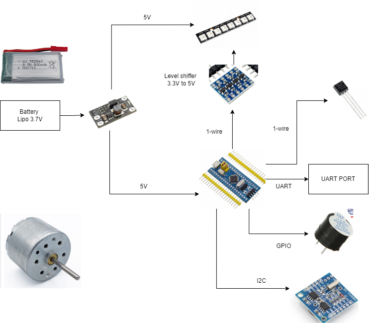

# LED FAN
## Table of Contents
  1. [Purpose](#1-purpose)
  2. [Features](#2-features)
  3. [Operating Principles](#3-operating-principles)
  4. [Design](#4-design)
  5. [Required Modules](#5-required-modules)
  6. [Detailed Features](#6-detailed-features)
  7. [Contributors](#7-contributors)
## 1. Purpose
In today's fast-paced world, whether it's for work or study, everyone has their own setup. However, the typical setup can often feel uninspiring and even hinder productivity. That's where the LED FAN comes in. Designed to transform your space into an engaging and interactive environment, it goes beyond the ordinary function of a fan merely cooling you down.
 With vibrant LED lights and innovative features, the LED FAN adds flair and excitement to your surroundings, making your workspace or study area more enjoyable and productive than ever before.
## 2. Features

The LED FAN project includes the following features:
1. **Real Time Display**: The Fan will be able to display the time (dates, hours, minutes).

2. **Reminders and Notifications**: Users can set timers, countdowns, reminder, and provide the desired audio and RGB LED notifications when the specified time is reached.

3. **Time configuration**: Users can configure the time, date displaying on the fan by setting time on a computer through UART communication.

## 3. Operating Principles
The operating principle of an LED fan revolves around the integration of LED (Light Emitting Diode) technology with the mechanics of a traditional fan. These fans typically feature small LEDs embedded within the fan blades or positioned around the perimeter of the fan housing.
The LEDs are connected to a control circuit that manages their illumination. This circuit can be programmed to produce various lighting effects, colors, and patterns. Some LED fans may incorporate sensors or microcontrollers to enable interactive features, responding to changes in environment or user input.

When the fan is powered on, the control circuit activates the LEDs, causing them to emit light. As the fan blades rotate, the LEDs create dynamic visual displays, producing patterns of light that can range from simple static colors to complex animations.
The operating principle of an LED fan is therefore a seamless synergy between mechanical motion and light emission, resulting in a captivating fusion of functionality and aesthetics.

In this scenario, the LED fan operates by synchronizing the turning on and off of LEDs with the position of the fan blades. With 120 positions in one cycle, each position corresponds to a specific angle of rotation for the fan blades.

To create letters, numbers, or any other patterns, a predetermined sequence of LED activations and deactivations is programmed into the control circuit. For example, if a letter "A" is to be displayed, the sequence of LED activations corresponding to the shape of the letter "A" would be mapped out across the 120 positions.

As the fan rotates, the control circuit triggers the LEDs to turn on and off according to the programmed sequence at each position. This synchronized activation of LEDs creates the illusion of static images or characters when viewed due to the persistence of vision phenomenon.

By carefully orchestrating the timing and pattern of LED activations, complex shapes, letters, and numbers can be displayed as the fan spins, providing a captivating visual experience. This method allows for dynamic content display on the fan, making it versatile for various applications such as advertising, signage, or artistic installations.

## 4. Design
### Sketch of LED FAN

### Firmware Architecture

### Device Diagram

## 5. Required Modules
| Module      | Functionality                                     |
| ----------- | ------------------------------------------------- |
| STM32F103C8T6 | Main micro-controller                 |
| DS1307      | Real-time clock module for timekeeping            |
| CJMCU-75    | Ambient temperature  module |
| BUZZER      | Audio module for notifications                    |
| WS2812 LED RGB     | Status indicator lights for the clock     |
| HALL SENSOR | Get signal magnetic field.|
| UART | Communication with computer.|
## 6. Detailed Features

**1. Real Time  Display**
| ID  | Functionality                  | Note                                                                 |
| --- | ------------------------------ | -------------------------------------------------------------------- |
| 01  | Display Current Time On a LED FAN | Display Hours, Minutes, Secons |
| 02  | Theme                          | Change color display of the LED FAN    |
| 03 | Brightness                          | Change Brightness display of the LED FAN    |

**2. Temperature and Humidity Display**

| ID  | Functionality                  | Note |
| --- | ------------- | -------------------------------------------------------------------------------------------- |
| 01  | Outdoor temperature in Celsius get over UART |

**3. Reminders and Notifications**
| ID  | Functionality | Note |
| --- | ------------- | -------------------------------------------------------------------------------------------- |
| 01  | Setting Time  | Set Year, Month, Day of Week, Day of Month, Hour, Minute, Second                             |
| 02  | Alarm         | Set alarm time, choose type of event to trigger sound and LED blinking                       |
  
4.**Computer Interaction Capability**
| ID  | Functionality             | Note                                                                    |
| --- | ------------------------- | ----------------------------------------------------------------------- |
| 01  | Control clock use command | User can use COM app on PC to set time, reminder, song, led, theme, ... |

## 7. Contributors
1. **Nguyen Nhat Kha**
2. **Bui Minh The**
3. **Ly Minh Khoi**