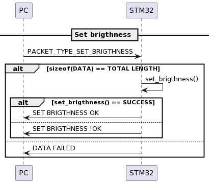

# LED FAN PROTOCOL

Welcome to our LED Fan Project! This protocol document serves as a clear, step-by-step guide for integrating LED technology with fan mechanics.

# Table of Contents
  1. [Frame of Protocol](#1-frame-of-protocol)
  2. [Start of frame](#2-start-of-frame)
  3. [Packet type](#3-packet-type)
  4. [Total length](#4-total-length)
  5. [Data](#5-data)
  6. [Stop of frame](#6-stop-of-frame)
  7. [Example](#7-example)

## 1. Frame of Protocol

**Frame**
    **START BYTE**  -   **PACKET TYPE**   -   **TOTAL LENGTH**  -   **DATA**    -     **STOP BYTE**
- **Start Byte** : Marks the beginning of the frame.
- **Header** : including Packet type and Total length.
- **Data** : the actual being transmitted.
- **Stop Byte** : Marks the end of the frame.

<em>Figure 1. Packet format</em>

## 2. Start of frame
Start byte **(1 byte)** : the beginning of the frame **_default AA_**

## 3. Packet type

**3.1. Packet type (1 byte )**
| Packet Type | Value | Description |
| --------------------------------------| -------- | ---------------------- |
| CMD_CHECK_UART  |   00   | Check activity of UART *Default data:* AA0005uart2BB|
| CMD_SET_TIME  |   01   | Set time by human time only mode 24h *Sample data:* AA012310h20p30s10d04m2024ywedBB|
| CMD_SET_EPOCH_TIME |   02   | Set time by epoch time only mode 24h *Sample data:* AA02101709303879BB|
| CMD_GET_TIME  |   03   | Get time current of RTC *Default data:* AA0307gettimeBB|
| CMD_SET_MODE_TIME |   04   | Set mode time 12h for RTC *Sample data:* AA040212BB|
| CMD_SET_ALARM |   05   | Set alarm mode 24h *Sample data:* AA050910h20p30sBB|
| CMD_CANCEL_ALARM |   06   | Cancel alarm *Default data:* AA0606cancelBB|
| CMD_SET_BRIGHTNESS |   07   | Modify brightness of display fan *Sample data:* AA0703050BB|
| CMD_SET_COLOR |   08  | Have 2 color default. Example: Set color 2 for display fan *Sample data:* AA08012BB|
| CMD_GET_TEMPERATURE |   09 | Get ambient temperature. *Default data:* AA0907gettempBB|

**3.2. Response**

<em>Figure 2.2.1 Response check uart</em>

<em>Figure 2.2.2 Response set human time</em>

<em>Figure 2.2.3 Response set epoch time</em>

<em>Figure 2.2.4 Response get time</em>

<em>Figure 2.2.5 Response set mode time</em>

<em>Figure 2.2.6 Response set alarm</em>

<em>Figure 2.2.7 Response cancle alarm</em>

<em>Figure 2.2.8 Response modify alarm</em>

<em>Figure 2.2.9 Response set brigthness</em>

<em>Figure 2.2.10 Response set color for display</em>

<em>Figure 2.2.11 Response select temperature F or C</em>

## 4. Total length
Total length **(2 byte)** : Indicates the number of bytes in the data (not including header).
## 5. Data
Data (nbytes) : Data of packet type
## 6. Stop of frame
Stop byte **( 1 byte)** : The end of the frame **_default BB_**
## 7. Example
    AA 01 04 abcd BB
- Start byte : AA
- Packet type : 01
- Total length : 04
- Data : "abcd"
- Stop byte : BB